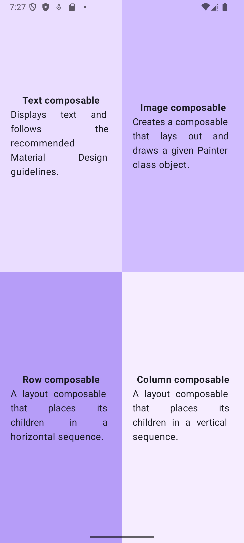
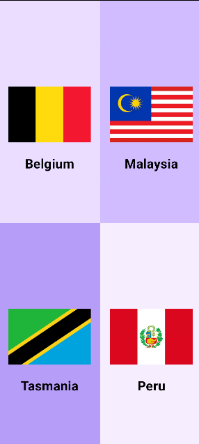
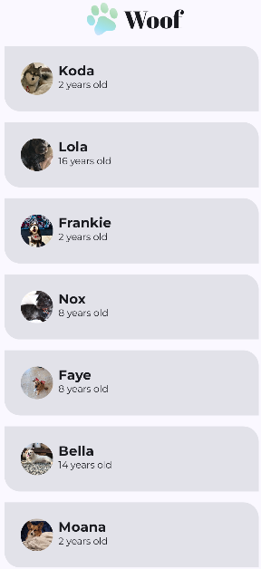
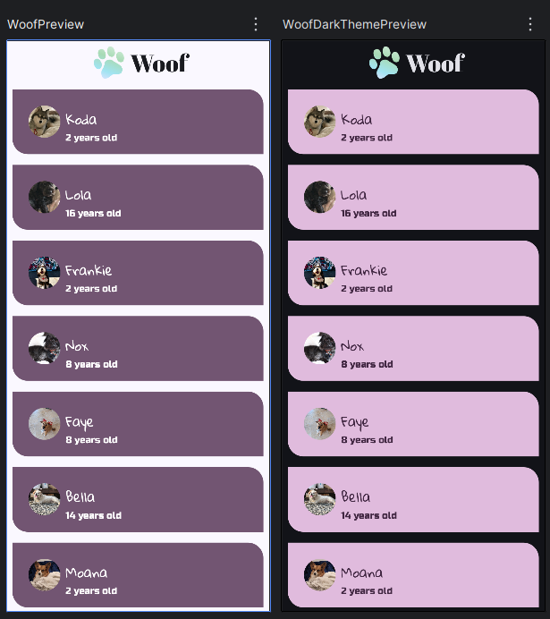
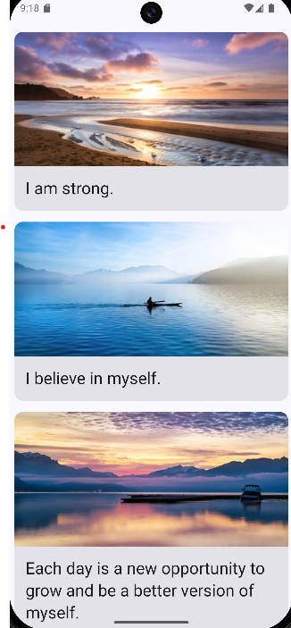
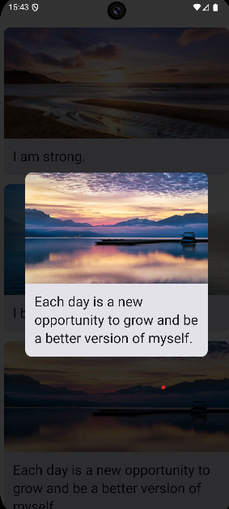

# Programming Portfolio - First Set of Exercises

*Please complete this document to confirm the work that has been done. You will also add your answers to the provided 
questions in the space provided*

Please replace ${\color{green}-- todo}$ with ${\color{blue}-- completed}$ once done.\
\
Include an appropriate screenshot from your application to confirm completion. Screenshots should be added to 
the /images folder in the top-level repo.\
\
Include the provided question for your exercise and your answer in the space provided.

---

### Happy Birthday ###

|   **First Part ${\color{blue}-- completed}$**    |    **Extension ${\color{blue}-- completed}$**    |
|:--------------------------------------------:|:--------------------------------------------:|
|  |  |

#### Question ####
>The Birthday/Christmas Example is localised to the English language. What changes would need to be done to make this app localised for the Spanish language.

https://developer.android.com/guide/topics/resources/localization

How would you test that your localised app worked as expected on the emulator?

Please include a screenshot of the new version working as part of the answer.

My own example with German language translation is shown below.

birthday_german

Make sure to add a final commit to your birthday branch with the amended code.
>  
>  
>  

#### Answer ####
> As read from the information sheet on the Android studio website if i want the text to be displayed in spanish ill need to create a new file inside the res folder, this should be called values-es, this will make it so if the system was to be set to spanish then it will load that text up withou the need of extra settings in the code, by leaving the values folder the same the system will use that as default file and load that up if it does not know the language.
> 
> 

> 
> 

---
### Quadrants ###

|    **First Part ${\color{blue}-- completed}$**    |    **Extension ${\color{blue}-- completed}$**     |
|:---------------------------------------------:|:---------------------------------------------:|
|  |  |

#### Question ####
> In the quadrants exercise, the layout of 2x2 has no issues on an orientation change. However, consider the impact a 3x2 in portrait would have when orientated. Is the preference for it to remain 3x2?

Typically, layouts adapt to meet user expectations.

quadrant_layout

For this question, please provide an answer indicating how this would be done using Composables. You should include in the answer the specific code elements that are aware of the device orientation. A good place to start is androidx.compose.ui.platform

To further demonstrate your knowledge of the answer - include a screenshot of a modified version of your quadrants to handle a 3x2 to 2x3 switch. Add as a final commit to your quadrants branch.
>  
>  
>  

#### Answer ####
>When the device is oriented in landscape mode, the configuration is designed to display two items per row and three columns, mirroring the layout used in portrait mode. However, if a 2x3 layout is preferred, utilizing androidx.compose.ui.platform can facilitate this adjustment. In my implementation, I imported androidx.compose.ui.platform.LocalConfiguration to determine whether the device is in landscape or portrait orientation, storing this information in a variable named isLandscape. Initially, no changes were observed. However, after enclosing the existing columns within a container and applying a conditional statement like "if (!isLandscape)", the landscape view disappeared, leaving only a blank screen. This occurs because the code is configured for portrait mode but not for landscape. To ensure the landscape view is also displayed, I needed to introduce an else statement that mirrors the portrait configuration. Additionally, to achieve the desired 2x3 layout, modifications are necessary to ensure that each row contains three items while limiting the total to two rows, thus creating a 2x3 arrangement.
> 
> 

> 

---

### Woof ###

| **First Part ${\color{blue}-- completed}$**  |  **Extension ${\color{blue}-- completed}$**  |
|:----------------------------------------:|:----------------------------------------:|
|  |  |

#### Question ####
> Woof displays a list of Cards. The Material 3 API offers several card definitions.

https://developer.android.com/reference/kotlin/androidx/compose/material3/package-summary

Having looked at this documentation, please list the changes that will need to be made to produce the following effect on a card - a pressed state that removes a dropped shadow. See the screenshot, this shows an elevated default state with a raised shadow and a pressed state with no elevation.

woof interaction

While this type of material change is the default behaviour for a Pressed State, how could this be overriden so that a border is added on the Pressed state.

woof custom_interaction

Useful information can be found at:

https://developer.android.com/develop/ui/compose/touch-input/user-interactions/handling-interactions

Please add an additional commit to your woof branch and include a screenshot similar to the one shown. Please note the the colour of your card is unimportant and you should just use the card colours that you currently have in your project.
>  
>  
>  

#### Answer ####
> *Please provide your answer in this space*
> 
> 

> 
> 

---

### Affirmations ###

|     **First Part ${\color{blue}-- completed}$**     |     **Extension ${\color{blue}-- completed}$**      |
|:-----------------------------------------------:|:-----------------------------------------------:|
|  |  |

#### Question ####
> In the documentation for Compose and LazyColumn, there is the paragraph:

https://developer.android.com/jetpack/compose/lists

“If you need to display a large number of items (or a list of an unknown length), using a layout such as Column can cause performance issues, since all the items will be composed and laid out whether or not they are visible.”

Using the LayoutInspector tool and the Affirmation example further explain the above statement. It is expected that your included answer will include a screenshot from the LayoutInspector tool that shows the issue with using Column rather than LazyColumn for long lists.

Layout Inspector is a tool inside of Android Studio that will show live views from the emulator

https://developer.android.com/studio/debug/layout-inspector

HINT: You will need to change the composable for the Affirmation example to:
>  
>  
>  

#### Answer ####
There are many reasons why a LazyColumn is better than a standard Column in this context, as illustrated by the layout inspector image.

The Column appears to load all items at once, as indicated by the presence of dropdown arrows next to each item, suggesting that they are all pulled on the screen along with their contents all at once. This can lead to performance issues, while Android Studio was running , I noticed lag in the user interface, and even Android Studio experienced occasional crashes. The primary drawback of using a Column is that it loads every items at once, including those not currently visible, which can slow down the device and potentially result in crashes. In contrast, the LazyColumn addresses this issue by loading each item only when the user scrolls to it, as demonstrated in the accompanying image.

It is evident that the LazyColumn does not immediately load every item; instead, it waits until an item is in view before rendering it. The two classes, Column and LazyColumn, are fundamentally similar, but the LazyColumn is more efficient for handling a large number of items without causing device lag, as it avoids loading all items at once. Conversely, the Column is more suitable for displaying a smaller number of items on the screen.

> 
> 

---

