# Programming Portfolio - Second Set of Exercises

*Please complete this document to confirm the work that has been done. You will also add your answers to the provided 
questions in the space provided*

Please replace ${\color{green}-- todo}$ with ${\color{blue}-- completed}$ once done.\
\
Include an appropriate screenshot from your application to confirm completion. Screenshots should be added to 
the /images folder in the top-level repo.\
\
Include the provided question for your exercise and your answer in the space provided.

---

### Cupcake ###

| **First Image ${\color{blue}-- completed}$** | **Second Image ${\color{blue}-- completed}$** | **Third Image ${\color{blue}-- completed}$** | **Fourth Image ${\color{blue}-- completed}$** |
|:--------------------------------------------:|:---------------------------------------------:|:--------------------------------------------:|:---------------------------------------------:|
| 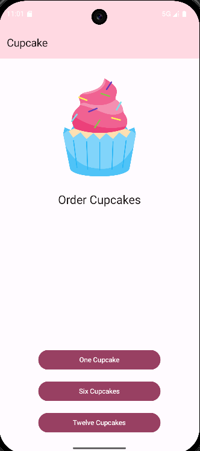     | 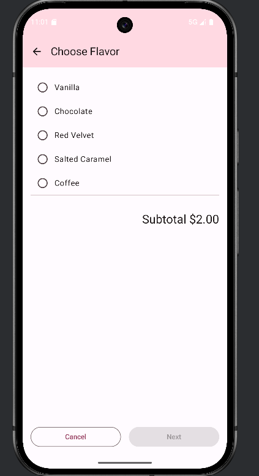      | 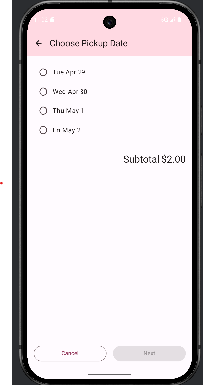     | 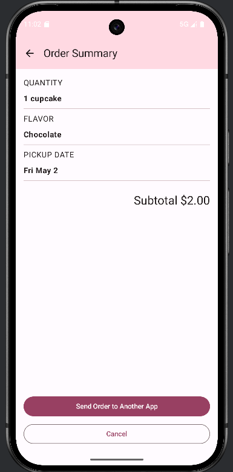      |

### Cupcake Extension ###

| **Extension ${\color{blue}-- completed}$** | **Extension ${\color{blue}-- completed}$** | **Extension ${\color{blue}-- completed}$** | **Extension ${\color{blue}-- completed}$** | **Extension ${\color{blue}-- completed}$** |
|:------------------------------------------:|:------------------------------------------:|:------------------------------------------:|:------------------------------------------:|:------------------------------------------:|
| 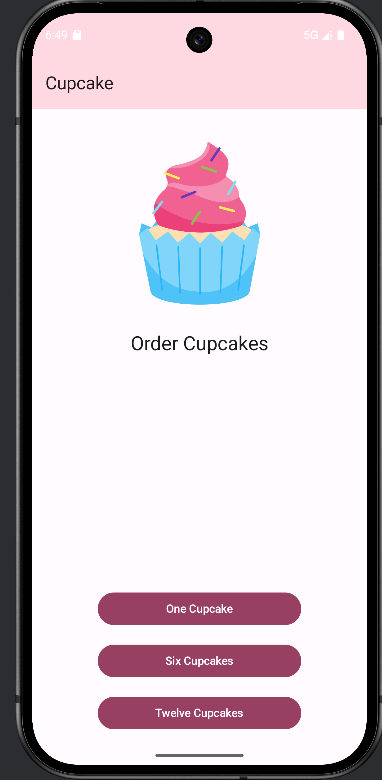            | 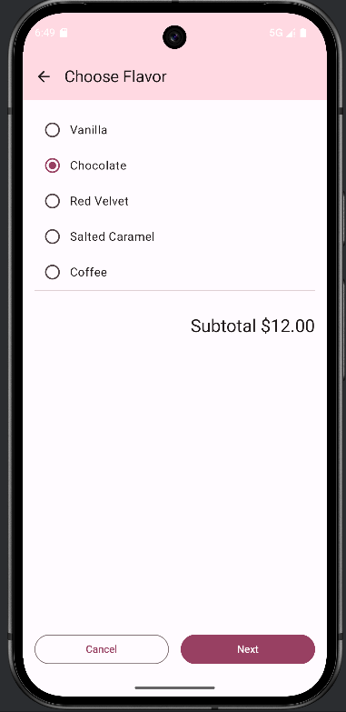    | 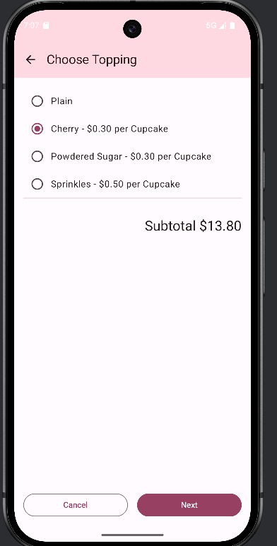    | 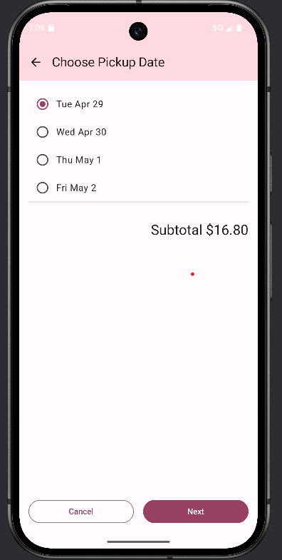    | 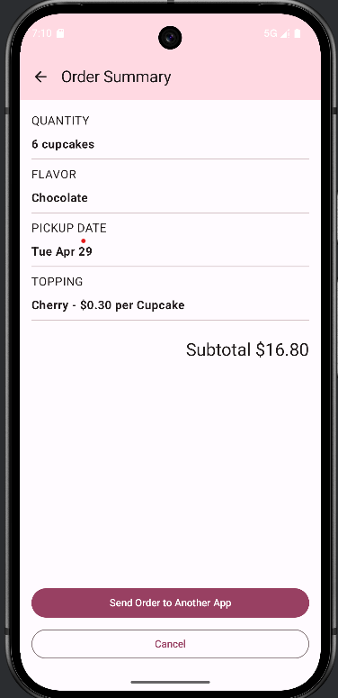    |

 
#### Question ####
> In the CupCake example, a NavHostController object is used. This allows the popBackStack method to be called. Which class does the NavHostController extend that contains the popBackStack() method?
Which other method(s) in this parent class is/are used to move between the other screens in the Cupcake example? How are these used - please make reference to the code and not just the visual output?
>  
> 
>  

#### Answer ####
> In the Cupcake NavHostController is used to manage navigation between different screens which is the derivative of the NavController class and comes with useful methods to manage the different navigation flows. This class extends the NavController and the methods used in the navigation flow are navigate and popBackStack. The former is used to move forward through the apps screens. This is seen when a user picks a flavor and taps next.
> Using navController.navigate(“pickup”)  makes it so the transision to the pickup date page happens, in the other hand the popbck is used to go back.
>  These methods are used in the composable functions that are used to handle user interactions. This is done to ensure that the navigation flow is well managed and not only dependent on the system back button.
> 
> 
> 
> In this image is has been proven that the popback fucntion is used to g back, this is because this is mainly used in the cancel section of the code, which is the section thats tasked to reset the app to the initial state, being the start of the order.
>
> The NavController functions can be found inside the Cupcake Screen and its the one that hold all the information regarding the movement of the screen for example its used in this line.
>
> 

> 
>
> And its used it to move through the page, for this i used it to move from the topping to the next page and this is done throughtout the whole document. If i havent said the NavController comes from the parent NavHostControllerr, which is why it has all the functions that are used in this application

---
### DiceRoller ###

|    **First Part ${\color{blue}-- completed}$**     |     **Extension Dice 1 ${\color{blue}-- completed}$**     |     ** Extension Dice 2 ${\color{blue}-- completed}$**     |
|:--------------------------------------------------:|:-----------------------------------------------:|:-----------------------------------------------:|
| 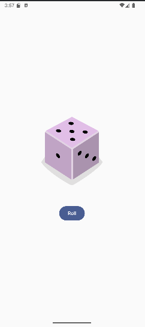            | 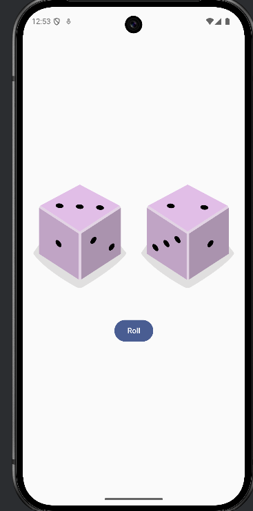         | 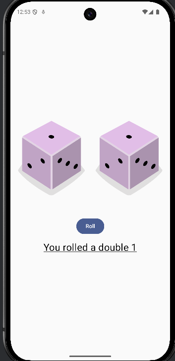         |

#### Question ####
> onCreate is passed a parameter (savedInstanceState: Bundle?). What is this? What value will it have on first run. Please evidence this value with the use of the debugger and an appropriate screenshot.

What may cause this Bundle to change in DiceRoller?

In your own implementation of DiceRoller, are you using this Bundle in anyway. Please note that depending on how you have approached DiceRoller will determine the correct response to this section.
>  
>  
>  

#### Answer ####
> Yes i do use it in my dice project and its called in the oncreate section with the savedintance of type Bundle?, this from the research that ive done, has been found out to be used to restore or retain previous information of a gui or state of application before it was shutdown, when the app is initially ran the bundle will always be null as theres no previous state here is how to prove this,
> 
> 
> 

In this image i placed a breakpoint and it clearly visible that the savestate is set to null, proving that the app if it does not have a previous state it will always result to null.
this is different if i do have a previous state which the device will always be refering to.
> 
> 

---

### DessertClicker ###

|      **First Part ${\color{blue}-- completed}$**       |      **First Part ${\color{blue}-- completed}$**       |       **Extension Dessert ${\color{blue}-- completed}$**       |       **Extension Dessert 2 ${\color{blue}-- completed}$**       |
|:-----------------------------------------------------:|:-----------------------------------------------------:|:-----------------------------------------------------------:|:------------------------------------------------------------:|
| 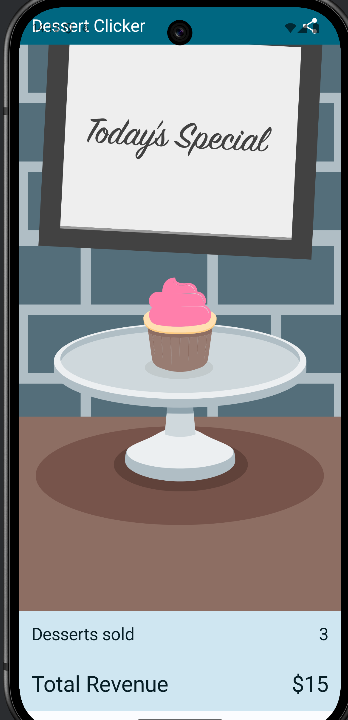        | 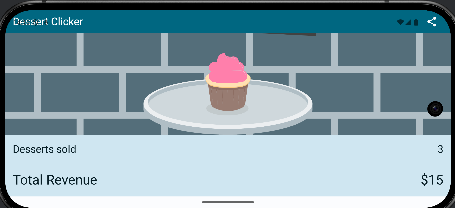        | 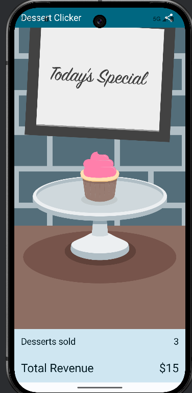   | 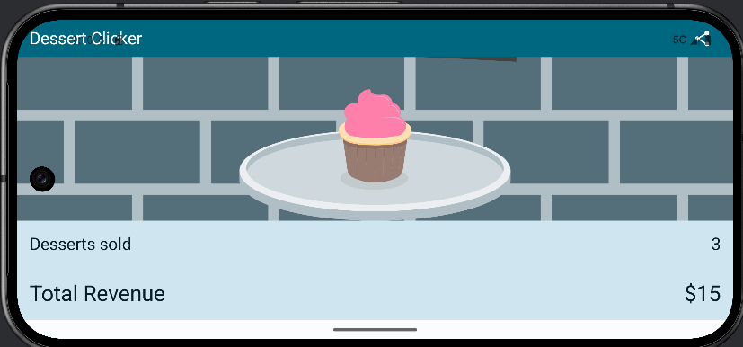  |

#### Question ####
> In completing the extension for DessertClicker you will have created a ViewModel class. Why is a viewmodel class instance created with the first line shown below and not the second?

val viewModel: DessertViewModel = viewModel()

val viewModel: DessertViewModel = DessertViewModel()

How might this understanding be evidenced through the use of the debugger. Please include a screenshot.

What design patterns are being used here.

(Please note that if you have not completed the extension to DessertClicker - you can use MarsPhoto ViewModel as the case study for the question)
>  
>  
>  

#### Answer ####
> The reason of this is because of the viewModel() which function uses ViewModel with the Compose lifecycle system, doing this makes it life cycle aware, this val makes it survive scren changes and screen rotations, The difference between viewModel() and DessertViewer() is that the dessertviewer is always going create a new object every time the composable is called which will break the lifecycle which is the one that saves the information in the screen when the screen changes, and to prevent this using viewModel is the best way to go.
> 
> 
> 
In this you can see that the screen does show a specific information like the order number this is what is seen for both version the viewModel and the DessertViewer, how ever when placed in landscape mode the DessertView resets the value to 0 this is because everything in the lifecycle gets destroyed.

> 

The other in the other hand even when the device is changed the value stays the same because the lifecycle does not get destroyed

> 

---

### MarsPhoto ###

|    **First Part ${\color{blue}-- completed}$**    |    **Extesion Mars 1 ${\color{blue}-- completed}$**    |    **Extesion Mars 2 ${\color{blue}-- completed}$**    |
|:-------------------------------------------------:|:--------------------------------------------:|:--------------------------------------------:|
| 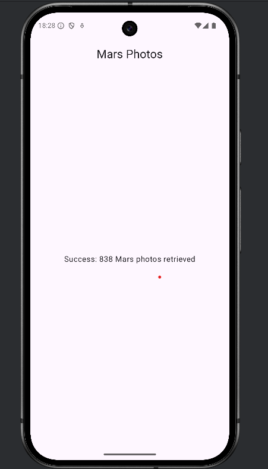        | 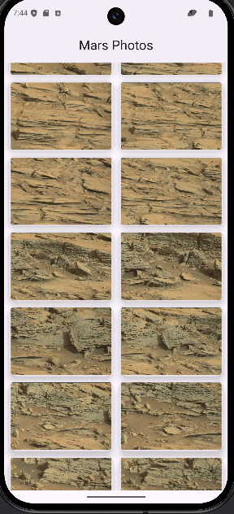      | 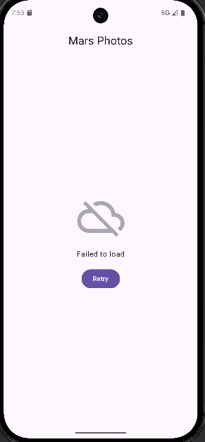       |

#### Question ####
> In MarsPhoto an external API is used to populate the application. This required a change to the manifest file to allow this to happen. What change was this?

If this change was not there, what would be the implication when the app was run? Please indicate as part of the answer the exception that is thrown by including a screenshot from the Logcat window.

Finally as part of this question – the manifest file will have an IntentFilter applied to an Activity. In the MarsPhoto, this would be:

<intent-filter>

<action android:name="android.intent.action.MAIN" />
<category android:name="android.intent.category.LAUNCHER" />

</intent-filter >

Please expand on the purpose of this
>  
>  
>  

#### Answer ####
> When i initiated this code and was adding a few information into the application, there was a part were the guide does point ou that a specific line of code was needed to be added in
> 
> in this image it shows that a permission is added to the AndroidManifest file, this is done so the file can actually acess the images, this also allows the app to access the network were the images are store if this is not present then the app will crash which it did when initially running the app.
> 
> 
This image proves that if the line is not present the application will always crash, but if its present the app will be able to succesfully connect to the networks and get the needed resources.
> 
> 

> 

---

